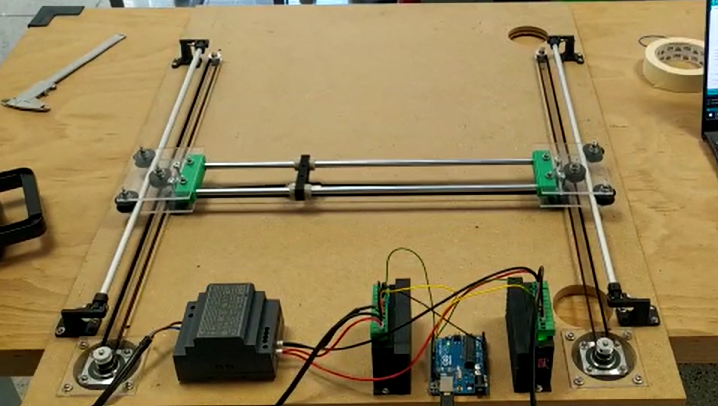

# CoreXY with Arduino

This project is about building and programming a coreXY robot from skrach.

## working principles

### Hardware
The slideways are made with pulleys on an 8mm cylindrical guide. The stepper used are two NEMA17 stepper motor and their drivers. All the components are 3D printed and CNC machined.

### Software
The python script reads a gcode file and send each line to the Arduino via UART comunication. For each line a checksum is implemented, in order to guarantee that the gcode has no errors. In case of failed comunication, the command instruction is sent again. The Arduino controls the two stepper motors. The stepper are controlled with custom algorithms, since the two stepper have to rotate at different speeds, more precisely they have to make different numbers of revolutions in the same time frame, so that the robot "head" can also move diagonal. The time between each step is not linear, but it is the image of a bezier curve, in order to make the stepper accelerate and decelerate at the same ratio between both stepper.

The robot head has also a computer vision tracking. The algorithm written with openCV, elaborates the brightes pixels in the image, which correspond to the LED mounted on it.
